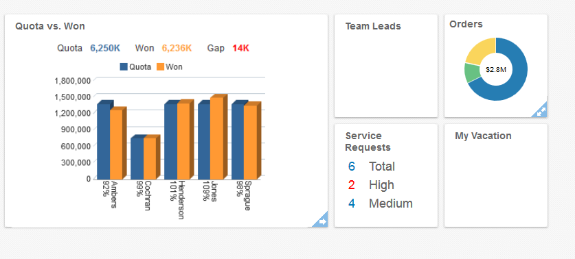
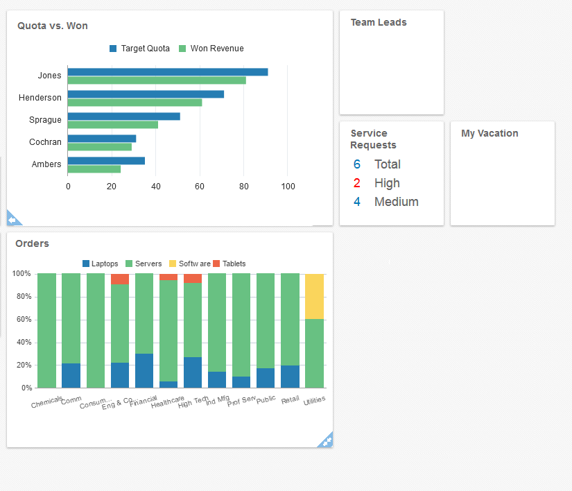

# Apps UX JET Challenge

## Overview

You have 3 hours complete the following tasks to the best of your ability. At
the 1 hour and 2 hour mark, we will check in on your progress, and answer any
questions that you may have during the process.

You will be evaluated on the following:

* Your ability to complete the given tasks
* Your ability to ask questions, both written and verbal
* Your ability to work independently
* Your ability to recreate a given design, and attention to detail
* Your code quality
* Your ability to explain your design decisions, both from a visual and
  engineering perspective

## Resources

While you may use any references at your disposal, you may find the following
resources to be the most useful for this exercise:

* Oracle JET
* KnockoutJS
* Mozilla Developer Network

## Setup

A default JET template is already provided for you in this repository.
However, you will still need to serve the application. We highly suggest using
the cli provided by the Oracle JET team

`[sudo] npm –g install ojet-cli`

`ojet serve`

## Task 1: Implement Infolets

Infolets are a common design pattern that we use here in Oracle. Please
implement infolets into your application. Figure 1 is an example of the infolets
we use here in Oracle.

### Figure 1

Hint: This is a component that is already created in Oracle JET, although
it is called something different. You should be able to find it under the 
Layout and Navigation category.

## Task 2: Implement All Infolets in Figure 1

Now that you've successfully implemented infolets, please implement the rest of
the infolets in figure 1. The charts should be using JET components.

## Task 3: Implement Flip and Expand

Please add flipping and expanding capabilities to the infolets. Figure 2 will
show you what we expect on the infolets once they have transformed.

### Figure 2

## Task 4: E-mail UI Designer

Please write a (fake) e-mail to Jane, the designer of this infolet page. Ask her
any questions that you may have about the design. Is there anything you would
like specifications for? Was there anything from the design that created major
challenges from a coding perspective?

## Task 5: Put Data into a JSON File

Some of the infolets use JET components. We would like you to place the JSON
data in a separate file, and have the application read the data separately.

## Notes

* We suggest that you start working on Task 4 after the 2 hour mark. It is
  probably the least time consuming of the tasks, and we are mostly looking for
  your ability to communicate.
* You are welcome to ask questions at anytime, and you should definitely reach
  out if you are having trouble with setup. However, keep in mind that you
  are being tested on your ability to work independently, and it would be best
  to save other questions for the hourly checkpoints. 
* If you copy code online, make sure to put the URL you obtained it from in your
  comments. Make sure you understand your code, because we will ask about it!
* Make sure you push your code to the git repository. Your access to the
  repository will be removed when you leave.
* We have no way of knowing whether you share the contents of this challenge
  with other people, but it would be in your own best interest to keep it to
  yourself.
* Time flies. Plan accordingly!
